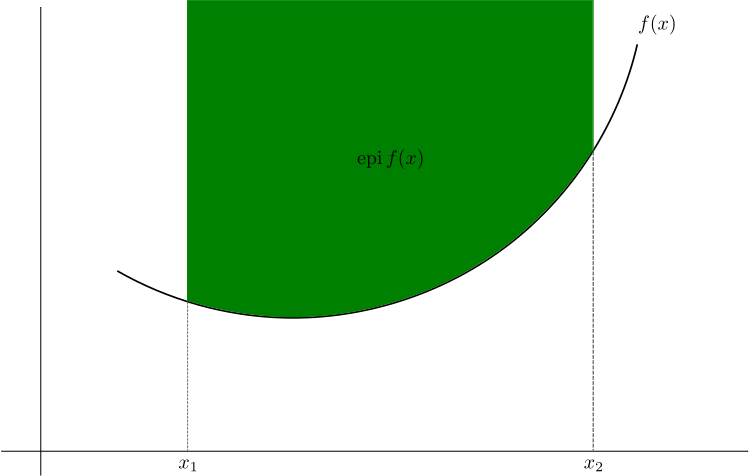

# (PART) Optimization {-}

# Basics of Optimization 


## Univariate Optimization 

```{theorem second-derivative, name = "Second derivative test for local extrema"}


Suppose $f''(x)$ is continuous on an open interval that contains $x = c$  

1. If $f'(c) = 0$ and $f''(c) > 0$, then $f(x)$ has a local minimum at $x = c$  

2. If $f'(c) = 0$ and $f''(c) < 0$, then $f(x)$ has a local maximum at $x = c$  

3. If $f'(c) = 0$ and $f''(c) = 0$, the the test fails. $f(x)$ my have a local maximum, a local minimum, or neither 
```


## Multivariate Optimization 


### ## Method of Lagrange Multiplier

## Convexity


```{definition convex-set, name = "Convext set"}

A set $S$ is said to be convex, if for every pair of points $\bar{w}_1, \bar{w}_2 \in S$, point $\lambda\bar{w}_1 + (1 - \lambda)\bar{w}_2$ must also be in $S$ for all $\lambda \in (0, 1)$ 
```

Intuitively, convexity means if we connect $\bar{w}_1, \bar{w}_2$ with a straight line, then all points along the line must be in set $S$. For example, an open interval $(a, b)$ on the 1-dimensional number line is a convex set. 

```{r, echo = FALSE, out.with = "120%"}
knitr::include_graphics("images/convex-set.png")
```

An property of convex set $S$ is that, given $r$ points $\bar{w}_1, ..., \bar{w}_r$ and $r$ nonnegative numbers $\lambda_1, ..., \lambda_r$ such that $\lambda_1 + \cdots + \lambda_r = 1$ ,the affine combination 

$$
\sum _{i=1}^r\lambda_i\bar{w}_k
$$
belongs to $s$. As the definition of a convex set is the case $r = 2$, this property characterizes convex sets. 

```{definition convex-function, name = "Convex function"}

Let $f(\cdot)$ be a real-valued function with a convex domain, so that if $f(\bar{w}_1), f(\bar{w}_2)$ is defined, for any $\lambda \in (0, 1)$, the expression $f\big( \lambda\bar{w}_1 + (1- \lambda)\bar{w}_2\big)$ is defined. For any $\lambda \in (0, 1)$ and $\bar{w}_1, \bar{w}_2$

- $f$ is called **convex** if 

$$
f\big(\lambda\bar{w}_1 + (1 - \lambda)\bar{w}_2\big) \le \lambda f(\bar{w}_1) + (1-\lambda)f(\bar{w}_2)
$$

- $f$ is called **strictly convex** if 

$$
f\big(\lambda\bar{w}_1 + (1 - \lambda)\bar{w}_2\big) \lt \lambda f(\bar{w}_1) + (1-\lambda)f(\bar{w}_2)
$$
```


Another more intuitive definition can be expressed as 

> $f$ is a convex function if its epigrah (the set of points lying on or above its graph) is a convex set. 


```{r, echo = FALSE, fig.cap = "A function is convex if and only if the region above its graph (in green) is a convex set. This region is the function's epigraph."}

```


Most often in machine learning problems we encountered a subset of optimization problems, *convex optimization*. That is 

$$
\text{minimize} \quad f(\bar{w}) \\
\text{subject to} \quad x \in C
$$
where $f:\mathbb{R}^n \to \mathbb{R}$ is a convex function and $C$ is a closed convex set.  


### Properties of Convex Functions 

```{theorem jensen-inequality, name = "Jenson's inequality"}

```

If $X$ is a random variable and $f$ is a convex function, then 

$$
E\big[f(X)\big] \ge f\big[E(X)\big]
$$
I find this very intuitive figure from https://www.bowaggoner.com/ to remember this formula

```{r, echo = FALSE}
knitr::include_graphics("images/jenson-inequality.jpg")
```


