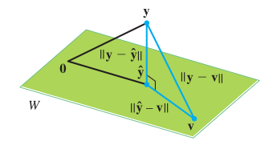

# Orthogonality 


## Orthogonal decomposition 


### Orthogonal complements

if vector $\boldsymbol{v}$ is orthogonal to every vector in a subspace $W$ of $\mathbb{R^n}$, then $\boldsymbol{v}$ is said to be orthogonal to $W$. The subspace that contains the set of vectors that are orthogonal to $W$ is called the **orthogonal complement**, denoted by $W^{\perp}$.  

$$
W^{\perp} = \{\boldsymbol{v} \in W^{\perp} | \;\boldsymbol{v} \perp \boldsymbol{x} \; \text{for all} \; \boldsymbol{x} \in W\}
$$

This corresponds to discussions in Section \@ref(fundamental-theorem), where 

$$
(\text{row}\,A)^{\perp} = \text{Nul}\,A \\
(\text{col}\,A)^{\perp} = \text{Nul}\,A^T
$$
<br>

```{theorem}
If $W$ is a subspace of $\mathbb{R}^n$, $W^{\perp}$ is also a subspace of $\mathbb{R}^n$.
```

It's easy to verify that $W^{\perp}$ is closed under scalar multiplication, and under vector addition, and that any vector in $W$ has $n$ components. So that $W^{\perp}$ is a subspace of $\mathbb{R}^n$


### Orthogonal sets and orthogonal basis

An orthogonal set is a set of vectors 
$\{\boldsymbol{u_1}, \dots, \boldsymbol{u_p}\}$ in $\mathbb{R^n}$, in which each pair of distinct vectors is orthogonal: $\boldsymbol{u_i}^{T} \boldsymbol{u_j} = 0 \quad i\not = j$. Note that the set do not necessarily span the whole $\mathbb{R^n}$, but a subspace $W$. 

Since vectors in orthogonal sets is mutually perpendicular, they must also be linearly independent and could form a basis for a subspace $W$. In such case, they are called **orthogonal basis**.  

There is a particular advantage in using orthogonal basis rather than other basis, because we can find a easy representation of any vector in $W$.  

```{theorem}
For each $\boldsymbol{y}$ in $W$, there exists a linear combination

$$
y = c_1\boldsymbol{u_1} + \cdots + c_p\boldsymbol{u_p}
$$
  
and 

$$
c_i = \frac{\boldsymbol{y} \cdot \boldsymbol{u_i}}{\boldsymbol{u_i} \cdot \boldsymbol{u_i}} \quad i = 1, \cdots, p
$$
  
where $\{\boldsymbol{u_1}, \dots, \boldsymbol{u_p}\}$ is an orthogonal basis. 
```

**Proof**

$$
\begin{split}
\boldsymbol{u_1} \cdot \boldsymbol{y} &= \boldsymbol{u_1} \cdot (c_1\boldsymbol{u_1} + \cdots + c_p\boldsymbol{u_p}) \\
  &= c_1 \boldsymbol{u_1} \cdot \boldsymbol{u_1}
\end{split}
$$
So: 

$$
c_1 = \frac{\boldsymbol{u_1} \cdot \boldsymbol{y}}{\boldsymbol{u_1} \cdot \boldsymbol{u_1}}
$$

Derivations for other $c_i$ is similar. 


### Orthogonal decomposition

**Orthogonal decomposition** split $\boldsymbol{y}$ in $\mathbb{R^n}$ into two vectors, one in $W$ and one in its orthogonal compliment $W^{\perp}$. 

```{theorem}
Let $\mathbb{R}^n$ be a inner product space and $W$ and subspace of $\mathbb{R}^n$. Then every $\boldsymbol{v}$ in $W$ can be written uniquely in the form

$$
\boldsymbol{v} = \boldsymbol{v}_w + \boldsymbol{v}_{\perp}
$$
  
where $\boldsymbol{v}_w \in W$ and $\boldsymbol{v}_{\perp} \in W^{\perp}$
```

**PROOF** 

Let $\boldsymbol{u}_1, ..., \boldsymbol{u}_m$ be a orthonormal basis for $W$, there exists linear combination according to Section \@ref(orthogonal-sets-and-orthogonal-basis) 

$$
\boldsymbol{v}_w = (\boldsymbol{v} \cdot \boldsymbol{u}_1)\boldsymbol{u}_1 + \cdots + (\boldsymbol{v} \cdot \boldsymbol{u}_m)\boldsymbol{u}_m
$$
and 

$$
\boldsymbol{v}_{\perp} = \boldsymbol{v} - \boldsymbol{v}_w
$$
It is clear that $\boldsymbol{v}_W \in W$. And we can also show that $\boldsymbol{v}_{\perp}$ is perpendicular to $W$ 

$$
\begin{split}
\boldsymbol{v}_{\perp} \cdot \boldsymbol{u}_i &= [\boldsymbol{v}- (\boldsymbol{v} \cdot \boldsymbol{u}_1)\boldsymbol{u}_1 - \cdots - (\boldsymbol{v} \cdot \boldsymbol{u}_m)\boldsymbol{u}_m] \cdot \boldsymbol{u}_i \\
&= (\boldsymbol{v} \cdot \boldsymbol{u}_1) - [(\boldsymbol{v} \cdot \boldsymbol{u}_i)\boldsymbol{u}_i \cdot \boldsymbol{u}_i] \\
&= 0
\end{split}
$$

which implies $\boldsymbol{v}_{\perp} \in W^{\perp}$. 

To prove that $\boldsymbol{v}_w$ and $\boldsymbol{v}_{\perp}$ are unique (does not depend on the choice of basis), let $\boldsymbol{u}_1', ..., \boldsymbol{u}_m'$ be another orthonormal basis for $W$, and define $\boldsymbol{v}_w'$ and $\boldsymbol{v}_{\perp}'$ similarly we want to get $\boldsymbol{v}_w' = \boldsymbol{v}_w$ and $\boldsymbol{v}_{\perp}' = \boldsymbol{v}_{\perp}$. 

By definition 

$$
\boldsymbol{v}_w + \boldsymbol{v}_{\perp} = \boldsymbol{v} = \boldsymbol{v}_w' + \boldsymbol{v}_{\perp}' 
$$

so 

$$
\underbrace{\boldsymbol{v}_w - \boldsymbol{v}_w'}_{\in W} = \underbrace{\boldsymbol{v}_{\perp}' - \boldsymbol{v}_{\perp}}_{\in W^{\perp}}
$$
From the orthogonality of these subspaces, we have 

$$
0 = (\boldsymbol{v}_w - \boldsymbol{v}_w') \cdot (\boldsymbol{v}_{\perp}' - \boldsymbol{v}_{\perp}) = (\boldsymbol{v}_w - \boldsymbol{v}_w') \cdot (\boldsymbol{v}_w - \boldsymbol{v}_w') = ||\boldsymbol{v}_w - \boldsymbol{v}_w'||^2
$$
Similarly we have $||\boldsymbol{v}_{\perp}' - \boldsymbol{v}_{\perp}||^2 = 0$. 

The existence and uniqueness of the decomposition above mean that 

$$
\mathbb{R}^n = W \oplus W^{\perp}
$$

whenever $W$ is a subspace. 

### Best approximation 

```{theorem, label = 'best-approximation', name = "The Best Approximation"}
Given $\boldsymbol{y}$ be any vector in $\mathbb{R^n}$, with its subspace $W$, let $\hat{\boldsymbol{y}}$ be the orthogonal projection of $\boldsymbol{y}$ onto $W$. Then $\hat{\boldsymbol{y}}$ is the closest point in $W$ to $\boldsymbol{y}$ in the sense that 

$$
||\boldsymbol{y} - \hat{\boldsymbol{y}}|| \le ||\boldsymbol{y} - \boldsymbol{v}||
$$
```

**PROOF**

Take $\boldsymbol{v}$ distinct from $\hat{\boldsymbol{y}}$ in $W$, we know that $\boldsymbol{y} - \hat{\boldsymbol{y}}$ is perpendicular to $\boldsymbol{v}$. According to Pythoagorean theorem, we have

```{r, echo = FALSE, fig.cap="figure from page p352, ch6 [@lay2006-3]", out.width = "120%"}

```

$$
||\boldsymbol{y}-  \boldsymbol{v}||^2 = ||\boldsymbol{\hat{y}} - \boldsymbol{v}||^2 + ||\boldsymbol{y} -\boldsymbol{\hat{y}}||^2 
$$
When $\boldsymbol{v}$ is distinct from $\boldsymbol{\hat{y}}$, $||\boldsymbol{\hat{y}} - \boldsymbol{v}||^2$ is non-negative, so the error term of choosing $\boldsymbol{v}$ is always larger than that of the orthogonal projection $\boldsymbol{\hat{y}}$.  


## Projection matrices


## Gram-Schmidt process

Then Gram-Schmidt process is a simple algorithm that transforms a set of linearly independent vectors into orthogonal or orthonormal basis for a subspace. In its essence, it is a sequential projection of $\boldsymbol{x}_{i}$ onto the space spanned by the previously created orthogonal set $\{\boldsymbol{v}_{1}, ..., \boldsymbol{v}_{i-1}\}$, and take the term in the orthogonal compliment to be $\boldsymbol{v}_{i}$. 

```{theorem gram-schmidt, name = "the Gram-Schmidt process"}
Given a basis $\{\boldsymbol{x}_1, ..., \boldsymbol{x}_p\}$ for a nonzero subspace $W$ of $\mathbb{R}^n$, define 

$$
\begin{aligned}
\boldsymbol{v}_1 &= \boldsymbol{x}_1 \\
\boldsymbol{v}_2 &= \boldsymbol{x}_2 - \frac{\boldsymbol{x}_2 \cdot \boldsymbol{v}_1}{\boldsymbol{v}_1 \cdot \boldsymbol{v}_1}\boldsymbol{v}_1 \\
\boldsymbol{v}_3 &= \boldsymbol{x}_3 
- \frac{\boldsymbol{x}_3 \cdot \boldsymbol{v}_1}{\boldsymbol{v}_1 \cdot \boldsymbol{v}_1}\boldsymbol{v}_1 
- \frac{\boldsymbol{x}_3 \cdot \boldsymbol{v}_2}{\boldsymbol{v}_2 \cdot \boldsymbol{v}_2}\boldsymbol{v}_2
\\
& \vdots \\
\boldsymbol{v}_p &= \boldsymbol{x}_p 
- \frac{\boldsymbol{x}_p \cdot \boldsymbol{v}_1}{\boldsymbol{v}_1 \cdot \boldsymbol{v}_1}\boldsymbol{v}_1 
- \frac{\boldsymbol{x}_p \cdot \boldsymbol{v}_2}{\boldsymbol{v}_2 \cdot \boldsymbol{v}_2}\boldsymbol{v}_2
- \cdots
- \frac{\boldsymbol{x}_p \cdot \boldsymbol{v}_{p-1}}{\boldsymbol{v}_{p-1} \cdot \boldsymbol{v}_{p-1}}\boldsymbol{v}_{p-1}
\end{aligned}
$$
  
Then $\{\boldsymbol{v}_1, ..., \boldsymbol{v}_p\}$ is an orthogonal basis for $W$. In addition 

$$
\text{Span}\{\boldsymbol{v}_1, ..., \boldsymbol{v}_p\} = \text{Span}\{\boldsymbol{x}_1, ..., \boldsymbol{x}_p\} 
$$
```

To make $\{\boldsymbol{v}_1, ..., \boldsymbol{v}_p\}$ an *orthonormal* basis, there is simply one more step of normalization 

$$
\{\boldsymbol{q}_i = \frac{\boldsymbol{v}_i}{||\boldsymbol{v}_i||}, \;i = 1, ... p\} 
$$


### QR factorizaiton 

For $A \in \mathbb{R}^{m \times n}$ with linearly independent columns $\boldsymbol{x}_1, ..., \boldsymbol{x}_n$, apply the Gram-Schmidt process to $\boldsymbol{x}_1, ..., \boldsymbol{x}_n$ amounts to *factorizing* $A$. 
 
```{theorem qr, name = "QR factorization"}
if $A$ is an $m \times n$ matrix with full column rank, then $A$ can be factored as $A = QR$, where $Q$ is an $m \times n$ matrix whose columns form an orthonormal basis of $\text{Col}\;A$ and $R$ is an $n \times n$ upper triangular invertible matrix with positive entries on its diagonal. 
```

**PROOF**  

Because $A_{m \times n}$ is full column rank, we can transform its column vector $\{\boldsymbol{x}_{1}, ..., \boldsymbol{x}_{n}\}$ into a new set of orthonormal basis $\{\boldsymbol{q}_{1}, ..., \boldsymbol{q}_{n}\}$ with Gram-Schmidt process. Let 

$$
Q = [\boldsymbol{q}_{1} \;\; \cdots \;\; \boldsymbol{q}_{n}]
$$
For $\boldsymbol{x}_i, \; i = {1, ..., n}$ in Span$\{\boldsymbol{x}_1, ... \boldsymbol{x}_k\}$, there exists a set of constant $r_{1k}, ..., r_{kk}$ such that ^[because Span$\{\boldsymbol{x}_1, ... \boldsymbol{x}_k\}$ is the same as Span$\{\boldsymbol{u}_1, ... \boldsymbol{u}_k\}$] 

$$
\boldsymbol{x}_k = r_{1k}\boldsymbol{q}_{1} + \cdots + r_{kk}\boldsymbol{q}_{k} + 0 \cdot\boldsymbol{q}_{k+1} + \cdots + 0 \cdot \boldsymbol{q}_{n}
$$

So 

$$
A = [\boldsymbol{x}_{1} \;\; \boldsymbol{x}_{2} \;\; \cdots \;\; \boldsymbol{x}_{n}] = [\boldsymbol{q}_{1} \;\; \boldsymbol{q}_{2} \;\; \cdots \;\; \boldsymbol{q}_{n}] 
\begin{bmatrix}
r_{11} & r_{12} & \cdots & r_{1n} \\
0 & r_{22} & \cdots & r_{2n} \\
\vdots & \vdots & & \vdots\\
0 & 0 & \cdots & r_{nn}
\end{bmatrix} 
= QR
$$
We could assume that $r_{kk} \ge 0$. (if $r_{kk} < 0$, multiply both $r_{kk}$ and $\boldsymbol{u}_k$ by $-1$)

## Orthonormal sets and orthogonal matrices

An orthogonal set whose components are all unit vectors is said to be **orthonormal** sets. 

### Orthogonal matrices  

An *orthogonal matrix* is a square matrix $Q$ whose inverse is its transpose:  

$$
(\#eq:orthogonal-matrix)
QQ^T = Q^TQ = I
$$

Another way of defining it is that an orthogonal matrix has both **orthonormal columns** and **orthonormal rows**.  

Orthogonal matrices have a nice property that they preserve inner products: 

$$
(Q\boldsymbol{x})^T(Q\boldsymbol{y}) = \boldsymbol{x}^TQ^TQ\boldsymbol{y} = \boldsymbol{x}^TI\boldsymbol{y} = \boldsymbol{x}^T\boldsymbol{y}
$$

A direct result is that $Q$ preserves L2 norms 

$$
||Q\boldsymbol{x}||_2 = \sqrt{(Q\boldsymbol{x})^T(Q\boldsymbol{x})} = \sqrt{\boldsymbol{x}^T\boldsymbol{x}} = ||\boldsymbol{x}||_2
$$

Therefore multiplication by an orthogonal matrix can be considered as a transformation that preserves length, but may rotate or reflect the vector about the origin. 

Note that $Q$ may not necessarily be a square matrix to satisfy $Q^TQ = I$. For exmaple $Q \in \mathbb{R}^{m \times n}, n < m$, but its columns and rows can still be orthonormal, then $QQ^T = I$. But in most cases the term orthogonal implies a square matrix $Q$. 

## Lesat squares problems 

```{definition}
the **normal equation** 
$$
A^TA\boldsymbol{x} = A^T\boldsymbol{b}
$$
```

$$
\begin{aligned}
A^T(\boldsymbol{b} - A\hat{\boldsymbol{x}}) &= \boldsymbol{0}
\end{aligned} \\
A^T\boldsymbol{b} - A^TA\hat{\boldsymbol{x}} = 0 \\
\hat{\boldsymbol{x}} = (A^TA)^{-1}A^T\boldsymbol{b}
$$