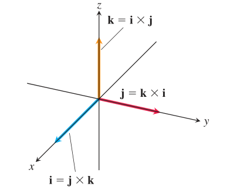
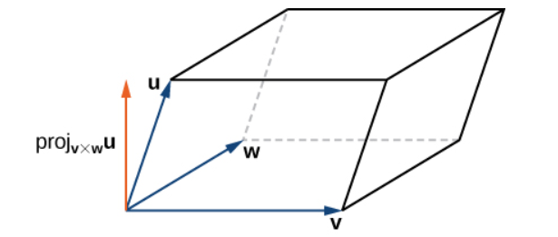

# Vector Spaces 

Vector spaces, metric spaces, normed spaces, and inner product spaces are places where computations in linear algebra happen. These spaces are defined more or less to generalize properties of Euclidean space.  

## Vector Space 

A **vector space** $V$ is a nonempty set,  also called *linear spaces*, the elements of which are called vectors,. A vector space comes with two operations predefined: vectors can be added together, and vectors can be multiplied by real numbers called scalars. For all vectors $\bar{u}, \bar{v}$ and $\bar{w}$, and all scalars $c$ and $d$ in $V$, the following axioms of vector space must hold:   

1. The sum of $\bar{u}$ and $\bar{v}$ is in $V$ 

2. The scalar multiple of $\bar{u}$ by c, denoted by $c\bar{u}$, is in $V$  

3. There exists additive identity (denoted by $\bar{0}$) such that $\bar{x} + \bar{0} = \bar{x}$. Similarly, multiplicative identity (written $\bar{1}$) means $\bar{1}\bar{x} = \bar{x}$  

4. There exists an additive inverse (written $-\bar{x}$) such that $-\bar{x} + \bar{x} = \bar{0}$  

5. Communitivity: $\bar{x} + \bar{y} = \bar{y} + \bar{x}$

6. Associativity: $(\bar{x} + \bar{y}) + \bar{z} = \bar{x} + (\bar{y} + \bar{z})$, and $\alpha(\beta\bar{x}) = (\alpha\beta)\bar{x}$  

7. Distributivity: $\alpha(\bar{x} + \bar{y}) = \alpha\bar{x} + \alpha\bar{y}$ and $(\alpha + \beta)\bar{x} = \alpha\bar{x} + \beta\bar{x}$
 
 
A set of vectors $\bar{v}_1, ..., \bar{v}_n \in V$ are set to be *linearly independent* if the following equation has only a traivial solution 

$$
\begin{align*}
c_1\bar{v}_1 + \cdots + c_n\bar{v}_n &= 0 && \text{implies } c_1 = \cdots = c_n = 0 
\end{align*}
$$

The **span** of  $\bar{v}_1, ..., \bar{v}_n$  is the set of all vectors that can be expressed as a linear combination of them. 

### Euclidean Space 

Euclidean space is the quintessential vector space, denoted by $\mathbb{R}^n$. 

The two must-have operations of vector spaces are valid in $\mathbb{R}^n$  

$$
\bar{x} = 
\begin{bmatrix}
x_1 \\
\vdots \\
x_n
\end{bmatrix}, \;\;
\bar{y} = 
\begin{bmatrix}
y_1 \\
\vdots \\
y_n
\end{bmatrix}, \;\;
\alpha \in \mathbb{R} \\
\bar{x} + \bar{y} = 
\begin{bmatrix}
x_1 + y_1 \\
\vdots \\
x_n + y_n
\end{bmatrix}, \;\;
\alpha\bar{x} = 
\begin{bmatrix}
\alpha x_1 \\
\vdots \\
\alpha x_n
\end{bmatrix}
$$

Euclidean spaces have other structures defined in addition to the plainest vector space. We can calculate *dot product*, *length*, *distance* by

$$
\begin{aligned}
\text{dot product between }  \bar{x} \text{ and } \bar{y}: \bar{x} \cdot\bar{y} &= \sum_{i=1}^{n}{x_iy_i} \\
\text{length of } \bar{x}: \|\bar{x}\| &= \sqrt{\bar{x} \cdot \bar{x}} \\
\text{distance between } \bar{x} \text{ and } \bar{y}: \text{dist}(\bar{x}, \bar{y}) &= \|\bar{x} - \bar{y}\|
\end{aligned}
$$


## Metric Spaces, Normed Spaces, Inner Product Spaces

### Metric and Norm

Metric spaces, normed spaces and inner product spaces capture important properties of Euclidean space in a more general way (distance, length, angle). 

Although metric spaces are not required to be vector spaces, it is always assumed in linear algebra that this is the case. For this reason, metric spaces are short for "metric linear space". Normed spaces and inner product spaces are defined to be extensions of metric linear spaces, so that they must be vector spaces. 

<hr>

Metrics generalize the notion of distance from Euclidean space. A *metric space* is a set together with a metric on the set (metric spaces don't have to be vector spaces). The metric is a function that defines a concept of distance $\in \mathbb{R}$ between any two members of the set. A metric must satisfies the following properties: 

1. $d(\bar{x}, \bar{y}) \ge 0$, with equality if and only if $\bar{x} = \bar{y}$. Distances are non-negative, and the only point at zero distance from $x$ is $x$ itself  
2. $d(\bar{x}, \bar{y}) = d(\bar{y}, \bar{x})$. The distance is a symmetric function. 
3. $d(\bar{x}, \bar{z}) \le d(\bar{x}, \bar{y}) + d(\bar{y}, \bar{z})$. Distance satisfies triangular inequality. 

<br>

Norms generalize the notion of length from Euclidean space. 

A **norm** on a real vector space $X$ is a function: $\|\cdot\|: V \rightarrow \mathbb{R}$ that satisfies: 

1. $\|\bar{x}\| \ge 0$ for all $\bar{x} \in X$, with equality if and only if $\bar{x} = \bar{0}$ (nonnegative)  
2. $\|\lambda \bar{x}\| = \lambda \|\bar{x}\|$, for all $\bar{x} \in X$ and $\lambda \in \mathbb{R}$ (homogeneous)  
3. $\|\bar{x} + \bar{y}\| \le \|\bar{x}\| + \|\bar{y}\|$ (triangular inequality)  

**A normed space is a metric space with the metric** 

$$
d(\bar{x}, \bar{y}) = \|\bar{x} - \bar{y}\|
$$

So a normed space is a special case of metric spaces, a metric spcae may not necessarily has a norm associated with it. One can verify that $d(\bar{x}, \bar{y}) = \|\bar{x} - \bar{y}\|$ satisfies all properties of a metric. 

The most common function for norms on $\mathbb{R}^n$ are listed below, with $\bar{x} = [x_1, x_2, ..., x_n]$. 

$$
\begin{align*}
\text{1-norm}: \|\bar{x}\|_1 &= \sum_{i=1}^{n}{|x_i|}\\
\text{2-norm}: \|\bar{x}\|_2 &= \sqrt{\sum_{i=1}^{n}{x_i}^2} \\
\text{p-norm}: \|\bar{x}\|_p &= (\sum_{i=1}^{n}{|x_i|}^p)^{\frac{1}{p}} \quad (p \ge 1) \\
\text{maximum norm}: \|\bar{x}\|_{\infty} &= \max\{|x_1|, |x_2|, ..., |x_n|\}
\end{align*}
$$

1-norm is also called the Manhattan norm. 

2-norm is the Euclidean norm, the subscript $2$ can be left out in $\mathbb{R}^n$. 

p-norm is a generalization of 1-norm and 2-norm, requiring $p > 1$. When $p$ turns infinity, $\|\bar{x}\|_{\infty}$ is called the maximum norm.

The VMLS book [@boyd2018introduction] introduces some other topics related to norm. 

**Root-mean-square value**. The root-mean-square (RMS) value of an $n$-vector $\bar{x}$ is defined as 

$$
\boldsymbol{\text{rms}}(x) = \sqrt{\frac{x_1^2 + \cdots + x_n^2}{n}} = \frac{\| \bar{x}\|}{\sqrt{n}}
$$


RMS is useful when comparing norms of vectors with different dimensions, because the value is independent of $n$, and it tells what a "typical" value of $|x_i|$ is.  The norm of a vector with all entries being the same value of $\alpha$ will be $\sqrt{n}|\alpha|$, yet its rms value will be $|\alpha|$.

**Norm of a sum**. The norm of the sum of two vectors $\bar{x}$ and $\bar{y}$ is 

$$
\|\bar{x} + \bar{y}\| = \sqrt{\|\bar{x}\|^2 + 2\bar{x}^T\bar{y} +  \|\bar{y} \|^2}
$$

This can be proven by expanding $(\bar{x} + \bar{y})^T(\bar{x} + \bar{y})$

**Norm of block vectors**. The norm-squared of a stacked vector is the sum of norm-square values of its subvectors. For example, if we stack 3 vectors $\bar{a}, \bar{b}, \bar{c}$ to form a longer vector $\bar{d}$

$$
\bar{d} = 
\begin{bmatrix}
\bar{a} \\
\bar{b} \\
\bar{c}
\end{bmatrix}
$$

We have 

$$
\| d\|^2 = \bar{a}^T\bar{a} + \bar{b}^T\bar{b} + \bar{c}^T\bar{c} = \|\bar{a}\|^2 + \|\bar{b}\|^2 + \|\bar{c}\|^2
$$
Another way of writing this is 

$$
\|(\bar{a}, \bar{b}, \bar{c})\| = \sqrt{ \|\bar{a}\|^2 + \|\bar{b}\|^2 + \|\bar{c}\|^2} = \|(\|\bar{a} \|, \|\bar{b} \|, \|\bar{c}\|)\|
$$

**Chebyshev inequality**


$$
\frac{\|\bar{x}\|^2}{k} \ge a^2
$$

Note that $\text{rms}(\bar{x}) = \|\bar{x}\| / \sqrt{n}$, so that $\|\bar{x}\|^2 = n \, \text{rms}(\bar{x})^2$. Then we have 

$$
\Big(\frac{\text{rms}(\bar{x})}{a}\Big)^2 \ge \frac{k}{n}
$$


**Average, RMS value, and standard deviation**. The mean and standard deviation of vector $\bar{x}$ can be written in the form 

$$
\begin{aligned}
\mu &=  \frac{1}{n}\bar{1}^T\bar{x} \\
\sigma &= \frac{\|\bar{x} - \mu\bar{1}\| }{\sqrt{n}}
\end{aligned}
$$

Then we have the following relationship 

$$
\text{rms}(\bar{x})^2 = \mu^2 + \sigma^2
$$


::: {.pr}

$$
\begin{split}
\sigma^2 
& = \frac{1}{n} \|\bar{x} -   \frac{1}{n}\bar{1}^T\bar{x}\bar{1}\|^2 \\
&= \frac{1}{n}[\bar{x}^T\bar{x} + \Big((\frac{1}{n}\bar{1}^T\bar{x})\bar{1}\Big)^T\Big((\frac{1}{n}\bar{1}^T\bar{x})\bar{1}\Big) - 2\bar{x}^T(\frac{1}{n}\bar{1}^T\bar{x})\bar{1}]  \qquad \mbox{norm of sum} \\
&= \frac{1}{n}[\bar{x}^T\bar{x} + \frac{1}{n}(\bar{1}^T\bar{x})^2 - \frac{2}{n}(\bar{1}^T\bar{x})^2] \\
&= \frac{1}{n}\bar{x}^T\bar{x} - \frac{1}{n^2}(\bar{1}^T\bar{x})^2 \\
&= \text{rms}(\bar{x}) - \mu^2
\end{split}
$$

:::


### Inner Produc, Outer Product, Cross Product

An **inner product** on a real vector space $X$ is a function $\langle \cdot, \cdot\rangle: X \times X \rightarrow \mathbb{R}$ satisfying 

1. $\langle \bar{x}, \bar{y} \rangle \ge 0$, with equality if and only if $x = \bar{0}$   
2. $\langle \bar{x}, \bar{y} \rangle = \langle \bar{y}, \bar{x} \rangle$
3. $\langle \bar{x} + \bar{y}, \bar{z}\rangle = \langle \bar{x}, \bar{z}\rangle + \langle \bar{y}, \bar{z}\rangle$ and $\langle \lambda \bar{x}, \bar{y}\rangle = \lambda \langle \bar{x}, \bar{y} \rangle$

A vector space equipped with such inner product is called a **inner product space**. Note that **all inner product spaces are normed spaces**, because a inner product induce a norm on a vector space: 

$$
\langle \bar{x}, \bar{x} \rangle = \|\bar{x}\|^2  
$$


The *standard inner product* defined on $\mathbb{R}^{n}$ is the dot product,  given by 

$$
\langle \bar{x}, \bar{y} \rangle = \sum_{i=1}^{n}{x_iy_i} = \bar{x}^T\bar{y}
$$


```{block2, type = "rmdnote"}
The abstract spaces—metric spaces, normed spaces, and inner product spaces—are all examples of what are more generally called “topological spaces” (linear topological space if they are assumed to be vector spaces first).  These spaces have been given in order of increasing structure. That is, every inner product space is a normed space, and in turn, every normed space is a metric space.
```


The **outer product** of an $m$ vector $\bar{a}$ and an $\bar{b}$ is given by $\bar{a}\bar{b}^T$, which is an **rank 1** $m \times n$ matrix

$$
\bar{a}\bar{b}^T = 
\begin{bmatrix}
a_1b_1 & a_1b_2 & \cdots & a_1b_n \\
a_2b_1 & a_2b_2 & \cdots & a_2b_n \\
\vdots & \vdots & & \vdots \\
a_nb_1 & a_nb_2 & \cdots & a_nb_n 
\end{bmatrix}
$$
The outer product is not symmetric, i.e. ($\bar{a}\bar{b}^T \not = \bar{b}\bar{a}^T$)

If we express an $m \times n$ matrix $A$ in terms of its columns $a_1, ..., a_n$ and the $n \times p$ matrix $B$ in terms of its rows $b_1, ..., b_p$

$$
A = 
\begin{bmatrix}
a_1 & \cdots & a_n
\end{bmatrix}, \quad
B = 
\begin{bmatrix}
b_1^T \\
\vdots \\
b_n^T
\end{bmatrix}
$$
The the matrix multiplication $AB$ can be expressed as the sum of outer products between $a_i$ and $b_i$

$$
AB = a_1b_1^T + \cdots + a_nb_n^T
$$
This echoes theorem \@ref(thm:cr-expansion), where matrix multiplication is computed via column row expansion. 

<br> 

Next, we bring in the concept of cross product which may not be so significant in the linear algebra section, but will shine in multivariate integral calculus. 

The **cross product** between $\bar{u}$ and $\bar{v}$ is a **vector** perpendicular to $\bar{u}$, $\bar{v}$ and the plane formed by them, with length equal to 


$$
\|\bar{u} \times \bar{v} \| = \|\bar{u}\| \|\bar{v}\| \sin \theta
$$

Let $\bar{n}$ denote the unit vector **perpendicular** to the plane containing $\bar{u}$ and $\bar{v}$, the cross product can be written as 

$$
\bar{u} \times \bar{v} = \|\bar{u}\| \|\bar{v}\| \sin (\theta)\bar{n}
$$

This definition is rarely helpful we because the main usage of cross product is finding the direction $\bar{n}$. 

In most cases, we only consider cross product in 3D spaces, although it can be generalized to higher dimensions.

Since the sines of $0$ and $\pi$, it makes sense that the cross product of two parallel vectors is zero. 

The cross product obeys the following laws 

1. $r\bar{u} \times s\bar{v} = rs (\bar{u} \times \bar{v})$

2. order matters: $\bar{u} \times \bar{v} = -\bar{v} \times \bar{u}$ 

3. Distributive: $\bar{u} \times (\bar{v} + \bar{w})= \bar{u} \times \bar{v} + \bar{u} \times \bar{w}$

4. Not associative: $\bar{u} \times (\bar{v} \times \bar{w}) = (\bar{u} \cdot \bar{w})\bar{v} - (\bar{u} \cdot \bar{v})\bar{w}$

To get a general formula of cross product, we consider the cross product among 3 standard basis $\boldsymbol{i} = [1, 0, 0], \boldsymbol{j} = [0, 1, 0], \boldsymbol{k} = [0, 0, 1]$ 


```{r, echo = FALSE, fig.cap = "Figure 12.30 FROM Thomas Calculus, 14th edition"}

```

$$
\begin{aligned}
\boldsymbol{i} \times \boldsymbol{j} &= \boldsymbol{k} \\
\boldsymbol{j} \times \boldsymbol{k} &= \boldsymbol{i} \\
\boldsymbol{k} \times \boldsymbol{i} &= \boldsymbol{j}
\end{aligned}
$$
and 

$$
\boldsymbol{i} \times \boldsymbol{i} = \boldsymbol{j} \times \boldsymbol{j} = \boldsymbol{k} \times \boldsymbol{k} = 0
$$

Then the cross product between $\bar{u}$ and $\bar{v}$ can be written as 

$$
\begin{split}
\bar{u} \times \bar{v} &= (u_1\boldsymbol{i} + u_2\boldsymbol{j} + u_3\boldsymbol{k}) \times (v_1\boldsymbol{i} + v_2\boldsymbol{j} + v_3\boldsymbol{k}) \\
&= (u_1v_1)\boldsymbol{i} \times \boldsymbol{i} + (u_1v_2)\boldsymbol{i} \times \boldsymbol{j} + (u_1v_3) \boldsymbol{i} \times \boldsymbol{k} \\
&{\quad} + (u_2v_1)\boldsymbol{j} \times \boldsymbol{i} + (u_2v_2)\boldsymbol{j} \times \boldsymbol{j} + (u_2v_3)\boldsymbol{j} \times \boldsymbol{k} \\
&{\quad} + (u_3v_1)\boldsymbol{k} \times \boldsymbol{i} + (u_3v_2)\boldsymbol{k} \times \boldsymbol{j} + (u_3v_3)\boldsymbol{k} \times \boldsymbol{k} \\
&= (u_2v_3 - u_3v_2)\boldsymbol{i} - (u_1v_3 - u_3v_1)\boldsymbol{j} + (u_1v_2 - u_2v_1)\boldsymbol{k} \\
&=  \begin{bmatrix}
u_2v_3 - u_3v_2 \\
u_1v_3 - u_3v_1 \\
u_1v_2 - u_2v_1
\end{bmatrix}
\end{split}
$$
This result is same as the determinant of the following matrix (think of  $\boldsymbol{i}, \boldsymbol{j}, \boldsymbol{k}$) as scalars and use cofactor expansion)

$$
\begin{split}
\bar{u} \times \bar{v} &= 
\begin{vmatrix}
\boldsymbol{i} & \boldsymbol{j} & \boldsymbol{k} \\
u_1 & u_2 & u_3 \\
v_1 & v_2 & v_3 
\end{vmatrix} \\
&= (u_2v_3 - u_3v_2)\boldsymbol{i} - (u_1v_3 - u_3v_1)\boldsymbol{j} + (u_1v_2 - u_2v_1)\boldsymbol{k} 
\end{split}
$$

The main use for cross product will be finding a vector which is perpendicular to two given vectors. We can make use of the magnitude as well. Recall the magnitude of the cross product is 

$$
\| \bar{u} \times \bar{v} \| = \|\bar{u}\| \|v\|\sin\theta
$$


This is the area of the following parallelogram defined by $\bar{u}$ and $\bar{v}$


```{r, echo = FALSE, fig.cap = "Figure 12.31 FROM Thomas Calculus, 14th edition"}
knitr::include_graphics("images/cross-product-2.png")
```
So let's review what the dot product gives us: its a vector perpendicular to the plane containing $\bar{u}$ and $\bar{v}$, the length of that vector is equal to the area of the parallelogram formed by $\bar{u}$ and $\bar{v}$. 

As one application of the cross product, we have the following theorem. 


```{theorem volume-cross-product, name = "Volume of a Parallelepiped"}
The volume of a parallelepiped with adjacent edges given by vectors $\bar{u}, \bar{v}$ and $\bar{w}$ is the absolute value of the *triple scalar product*

$$
V = |\bar{u} \cdot (\bar{v} \times \bar{w})|
$$
```


```{r, echo = FALSE, fig.cap = "Figure 2.59 from https://openstax.org/books/calculus-volume-3/pages/2-4-the-cross-product"}

```

::: {.pr}

The area of the base of the parallelepiped is given by $\|\bar{v} \times \bar{w}\|$, the height is $\bar{u}$ projected on to the resulting vector from the dot product. So we have

$$
\begin{split}
V &= \|\text{proj}_{\bar{v} \times \bar{w}} \bar{u} \|\|\bar{v} \times \bar{w}\| \\
&= |\frac{\bar{u} \cdot (\bar{v} \times \bar{w})}{\| \bar{v} \times \bar{w} \|} |\| \bar{v} \times \bar{w} \| \\
&= |\bar{u} \cdot (\bar{v} \times \bar{w})|
\end{split}
$$


Looking back at the formula for $\bar{v} \times \bar{w}$, we can see that this term is the absolute value of the following determinant according to cofactor expansion 

$$
\begin{vmatrix}
\bar{u}^T \\
\bar{v}^T \\
\bar{w}^T \\
\end{vmatrix}
$$


:::


### Restricted Definition of Inner Products in $R^n$

Sometimes it suffice only to generalize the dot product, with the definition of inner product, in Euclidean space $\mathbb{R}^n$ instead of other inner product spaces. For example, many engineering applications measure similarity between vectors using the dot product after stretching the two vectors in some directions, with linear transformation $A$. Therefore, we can given a restricted definition of inner product that is meant to be used in $\mathbb{R}^n$.  


```{definition restricted-inner-product, name = "Restricted definition of inner product"}

The generalized dot product $\langle \bar{x}, \bar{y}\rangle$ in $\mathbb{R}^n$ between two vectors, is the dot product between $A\bar{x}$ and $A\bar{y}$, for some $n \times n$ **positive definite matrix $S$**. The inner product $\langle \bar{x}, \bar{y}\rangle$ can also be expressed using the Gram matrix $S = A^TA$
```

$$
\langle \bar{x}, \bar{y}\rangle =\bar{x}^TS\bar{y}  = \bar{x}(A^TA)\bar{y} 
$$

It's easy to see that when $S$ is the identity matrix, the inner product is the dot product. $S$ being positive semidefinite ensures $\bar{x}^TS\bar{y}$ satisfies axioms of inner product.     

This definition of inner product also induces angles and distances with respect to transformation $A$ 


$$
\cos_A{(\bar{x}, \bar{y})} = \frac{\langle \bar{x}, \bar{y}\rangle}{\sqrt{\langle \bar{x}, \bar{x}\rangle}\sqrt{\langle \bar{y}, \bar{y}\rangle}}
= \frac{\bar{x}S\bar{y}}{\sqrt{\bar{x}S\bar{x}}\sqrt{\bar{y}S\bar{y}}}
= \frac{(A\bar{x})^T(A\bar{y})}{\|A\bar{x}\|_2\|A\bar{y}\|_2} \\
\text{dist}(\bar{x}, \bar{y}) = \sqrt{\langle \bar{x} - \bar{y}, \bar{x} - \bar{y} \rangle}
= \sqrt{(\bar{x} - \bar{y})^TS(\bar{x} - \bar{y})}
= \|A\bar{x} - A\bar{y} \|_2
$$


## Subspaces

If $A$ is a vector space, then $S$ is a subspace of $A$ (denoted $S \subseteq A$) if 

1. $\bar{0} \in S$  

2. $S$ is closed under addition: if $\bar{x}, \bar{y} \in S$, then $\bar{x} + \bar{y} \in S$  

3. $S$ is closed under scalar multiplication if $\bar{x} \in S, \alpha \in \mathbb{R}$ then $\alpha\bar{x} \in S$

According to this definition, and vector space is always a subspace of itself. 

If $U$ and $W$ are all subspaces of $V$, then the sum of these two subspaces are defined as 

$$
U + W = \{\bar{u} + \bar{v} \;| \; \bar{w} \in U, \bar{w} \in W \}
$$

If $U$ and $W$ are perpendicular, in other words, $U \cap W = \bar{0}$. Then $U + W$ are said to be a **direct sum** and written $U \oplus W$. 

Dimensions of the sum of subspaces has the following property 

$$
\text{dim}(U + W) = \text{dim}(U) + \text{dim}(W) - \text{dim}(U \cap W)
$$

It follows that if $U$ is perpendicular to $W$, $W$, 

$$
\text{dim}(U \oplus W) = \text{dim}(V)  = \text{dim}(U) + \text{dim}(W)
$$


## Fundamental Theorem of Linear Algebra  {#fundamental-theorem}

The **columnspace** (also called *range*) of matrix $A \in \mathbb{R}^{m \times n}$ is the span of the columns of $A$

$$
\mathcal{R}(A) = \{\bar{v} \in \mathbb{R}^m\;|\; \bar{v} = A\bar{x}, \, \bar{x} \in \mathbb{R}^n\}
$$

Similarly, the **rowspace** of $A$ is the span of its rows $\mathcal{R}(A^T)$. 

The **nullspace** (also called *kernel*) of $A$ is the set of solutions to $A\bar{v} = \bar{0}$ 

$$
\mathcal{N}(A) = \{\bar{x} \in \mathbb{R}^n\;|\;A\bar{x} = \bar{0}\}
$$

And the left null space is all $\bar{x}$ that satisfies $A^T\bar{x} = \bar{0}$. The word "left" in this context stems from the fact that $A^T\bar{x}= \bar{0}$ is equivalent to $\bar{x}^TA=\bar{0}$ where y "acts" on A from the left.  

The relationship between these four subspaces present the fundamental theorem of linear algebra 


```{theorem fundamental-theorem, name = "The fundamental theorem of Linear Algebra"}


- $\mathcal{R}(A) = \mathcal{N}(A^T)^{\perp}$, and $\dim(\mathcal{R}(A)) + \dim(\mathcal{N}(A^T)) = m$  

- $\mathcal{R}(A^T) = \mathcal{N}(A)^{\perp}$, and $\dim(\mathcal{R}(A^T)) + \dim(\mathcal{N}(A)) = n$
```


If the rank (defined next section) of $A \in \mathbb{R}^{m \times n}$ is $r$ 


- $m - r$ is the dimension of the left null space of $A$  

- $n - r$ is the dimension of the null space of $A$


## Rank 


The **rank** of a vector space is its dimension. 

```{definition}
The rank of a matrix is equal to the rank of its column space, which is the same as the rank of its column space. 
```

I often think of rank of $A$ as the total volume of information that the matrix can offer.   

From the definition of matrix rank, we know that $A$'s row rank (the dimension of $\mathcal{R}(A^T)$)equals its column rank $\mathcal{R}(A)$. A way to verify this are presented below.

All matrices can be reduced into a (possibly rectangular) *diagonal matrix* with elementary row and column operations. First we can row reduce the matrix into row echelon form, then use column operations to convert positions above the pivot to zero. 

Thus, any $A \in \mathbb{R}^{m \times n}$ can be expressed in the following form

$$
RAC = \Lambda \tag{1}
$$

where $R$ is the product of the elementary matrices that perform row opertations, and $C$ for column operations. Since $C$ is invertible, we can write 

$$
RA = \Lambda C^{-1} \tag{2}
$$

From (1) we know that row rank of $A$ is identical to that the number of non-zero entries in $\Lambda$, on the ground that row operations on $A$ does not change its row rank, and $C^{-1}$ only scale diagonal entries of $\Lambda$ to some multiple. Similarly, $AC = R^{-1}\Lambda$ shows that column rank of $A$ is the same as the number of non-zero diagonal entries in $\Lambda$. Therefore, row rank $=$ column rank. 

### Effect of Operations on Matrix Rank  

Let $A, B \in \mathbb{R}^{m \times n}$ have ranks $a$ and $b$

```{corollary}
  

1. $|a - b| \le  r(A + B) \le a + b$  

2. $r(AB) < \min(a, b)$   
```


::: {.pr}

For (1), rows / columns of $A + B$ can be expressed as linear combinations of rows / columns of $A$ and $B$. 

For (2), Each column of $AB$ is a linear combination of columns of A, and each row is a linear combination of rows of $B$. Therefore, $r(AB)$ can not exceed either rank of $A$ or $B$. There is also a corollary on the lower bound of $r(AB)$, which is $a + b - n$. Note that $n$ is the shared dimension. I have not found a concise proof about this, but this property leads to a interesting result: when one of $A$ and $B$ are square and full rank, $\min(r(AB)) = \max(r(AB))$

:::

```{corollary}
  

3. Multiplying $A$ with a square matrix $B$ of full rank does not change the rank of $A$.   

4. If $A$ and $B$ are both singular, then $AB$ is non-singular if and only if $A$ and $B$ are both non-singular 
```


::: {.pr}

Suppose $B$ is $n \times n$ matrix with rank $n$, the minimum rank of $AB$ is $a + n - n = a$, and the maximum rank is $\min(a, n) = a$. Thus, multiplying by a full rank matrix preserves rank: $r(AB) = r(A)$. (4) follows naturally after (3). 

:::

### Gram Matrix

```{proposition gram-matrix, name = "Gram matrix"}
The matrix $A^TA$ is said to be the Gram matrix of column space of $A_{m \times n}$. The columns of $A$ are linearly independent if and only if $A^TA$ is invertible.
```


::: {.pr}

When $A^TA$ is invertible, it has rank $n$. Therefore,  each of the factors of $A^TA$ has at least rank $n$, and this means columns of $A$ are linearly independent (since $r(A) \le \min(m, n)$). 

Similarly, $AA^T$ are called the left Gram matrix of rowspace of $A$. And $AA^T$ is invertible if and only rows of $A$ are linearly independent.

:::

```{proposition gram-matrix-rank}
For any matrix $A \in \mathbb{R}^{m \times n}$, $A$, $A^TA$ and $AA^T$ always have the same rank.

$$
r(A) = r(A^TA) = r(AA^T)
$$
```

::: {.pr}
For $r(A) = r(A^TA)$, suppose $r(A) = r$, then $\dim(\mathcal{N}(A)) = n - \dim(\mathcal{R}(A^T)) = n - r$. Note that for any $\bar{x}$ that satisfies $A\bar{x} = 0$, we have $A^TA\bar{x} = 0$. It follows that $A$ and $A^TA$ have the same null space, $\mathcal{N}(A)  = \mathcal{N}(A^TA)$. Since $A^TA \in \mathbb{R}^{n \times n}$, we have $r(A^TA) = \dim(\mathcal{R}((A^TA)^T)) = n - \dim(\mathcal{N}(A^TA)) = r$. 

For $r(A) = R(AA^T)$, note that $r(A) = r(A^T)$,  and that $\mathcal{N}(A^T) = \mathcal{N}(AA^T)$, then the conclusion presents itself. 
:::


<hr>

From the SVD perspective(Corollary \@ref(cor:same-nonzero) and Section \@ref(svd-theorem)), one can show that $A^TA$ and $AA^T$ have the same set of nonzero eigenvalues, and $r(A)$ is the same as the number of nonzero eigenvalues of $A^A$ or $AA^T$, so that $r(A) = r(A^TA) = r(AA^T)$.   


## Bases and Coordinate Systems

```{definition basis, name = "basis of a vector space"}
Let $V$ be a subspace of $\mathbb{R}^n$. An indexed set of vectors $\mathcal{B} = \{\bar{a}_1, ..., \bar{a}_r\}$ is said to be a basis of $V$, if $\mathcal{B}$ spans $V$ (these $r$ vectors are linearly independent)
```

Note that $\bar{a}_1, ..., \bar{a}_r$ are n-dimensional vectors themselves, though $V$, the subspace they span, is a hyperplane that has dimension strictly less than $n$ when $r < n$. 


```{definition coordinates, name = "coordinates"}
The coordinates of $\bar{v}$ relative to basis $\mathcal{B}$ (or the $\mathcal{B}$-coordinates of $\bar{v}$, denoted by $[\bar{v}]_{\mathcal{B}}$) are the weights $x_1, ..., x_r$ such that $\bar{x} = x_1\bar{a}_1 + \cdots +  x_r\bar{a}_n$
```


```{theorem unique-coordinate, name = "Unique coordinate vector"}
Let $\mathcal{B} = \{\bar{a}_1, ..., \bar{a}_n\}$ be a basis of $V$. Then for any vector $\bar{v} \in V$, there exists a unique coordinate vector $\bar{x} = [x_1, ..., x_r]$ such that

$$
\bar{v} = x_1\bar{a}_1 + \cdots + x_r\bar{a}_r
$$
```

Suppose $\bar{v}$ has another representation 

$$
\bar{v} = y_1\bar{a}_1 + \cdots + y_r\bar{a}_r
$$
Then, subtracting we have 

$$
\bar{0} = \bar{x} - \bar{x} = (x_1 - y_1)\bar{a}_1 + \cdots + (x_r - y_r)\bar{a}_r
$$
Since $\{\bar{a}_1, ..., \bar{a}_r\}$ is a linearly independent set, we have $x_i = y_i$ for $1 \le i \le r$. Thus, the coordinates $\bar{x}$ of any vector in $V$ in terms of a certain basis is always unique.


Note that the coordinate vector of the n-dimensional vector $\bar{v}$ contains $r$ components instead of $n$, each of which corresponds to a weight associated with one basis in $\mathcal{B}$. 

The default basis in $\mathbb{R}^n$, is the collection of $n$ n-dimensional vectors $\{\bar{e}_1, ..., \bar{e}_n\}$. Each of $\bar{e}_i$ contains a $1$ in the $i$th entry and a value of $0$ in all other entries. 

$$
\bar{e}_1 = 
\begin{bmatrix}
1 \\
0 \\
\vdots \\
0
\end{bmatrix}
,\, 
\bar{e}_2 = 
\begin{bmatrix}
0 \\
1 \\
\vdots \\
0 \\
\end{bmatrix}
, \, \cdots
,\, \bar{e}_n = 
\begin{bmatrix}
0 \\ 
0 \\
\vdots \\
1 
\end{bmatrix}
$$


The next question is, given $a basis \mathcal{B} = \{\bar{a}_1, ..., \bar{a}_r\}$ other than the standard one, how can we find the unique coordinates of $\bar{v}$, which is by default expressed in terms of the standard basis. 

We start with a special case where $\{\bar{a}_1, ..., \bar{a}_r\}$ forms a **orthonormal** basis of $V$, then the coordinates $\{x_1, ..., x_r \}$ with reference to this basis can be obtained by taking the dot product of $\bar{v}$ with each of  $\{\bar{a}_1, ..., \bar{a}_r\}$. To see this, note that we have 

$$
\bar{v} = 
\begin{bmatrix}
a_1 & a_2 & \cdots & a_r
\end{bmatrix}
\begin{bmatrix}
x_1 \\
x_2 \\
\vdots \\
x_r
\end{bmatrix}
$$
Thus, we have $\bar{v} = \sum x_i\bar{a}_i$. 

Taking dot product on both sides of $\bar{v} = \sum x_i\bar{a}_i$ with each $\bar{a}_i$ and using $\bar{a}_i^T\bar{a}_i = 1, \, \bar{a}_i^T\bar{a}_j = 0$, we can show that $x_i = \bar{a}_i^T\bar{v}$. 

This is a frequently used result that, if $\bar{a}_i$ is a unit vector, $\bar{a}_i^T\bar{v}$ will project $\bar{v}$ onto $\bar{a}_i$ and return a coordinate component of $\bar{v}$ in terms of $\bar{a}_i$. Moreover, we get the whole coordinate vector of $\bar{v}$ with respect to $[\bar{a}_1 \, \cdots \bar{a}_r]$ by 

$$
\begin{aligned}
A &= [\bar{a}_1 \, \cdots \bar{a}_r] \\
A^T\bar{v} &=
\begin{bmatrix}
\bar{a}_1^T\bar{v} \\
\vdots  \\
\bar{a}_r\bar{v}
\end{bmatrix} 
= 
\begin{bmatrix}
x_1 \\
\vdots \\
x_r \\
\end{bmatrix}
\end{aligned} 
$$


When the set $\bar{a}_1, ..., \bar{a}_r$ are not orthonormal, a general strategy is solving the system of equations $A\bar{x} = \bar{v}$. This boils down to a linear system problem extensively discussed in Chapter \@ref(linear-system). 


### Change of Basis

Previous discussions involve different representations of $\bar{x}$ with respect to two basis, one of which is the standard basis in $\mathbb{R}^n$. This section deals with transformations between two non-standard basis. 

Now suppose $A = [\bar{a}_1, ..., \bar{a}_n]$ and $B = [\bar{b}_1, ..., \bar{b}_n]$ are both bases for $\mathbb{R}^n$. And the vector $\bar{x}$ has coordinates $\bar{x}_a, \bar{x}_b$ with respect to $A$ and $B$ respectively. The goal is to find an $n \times n$ matrix $ P_{a \rightarrow b}$ such that it transforms one coordinate to another 

$$
\bar{x}_b = P_{a \rightarrow b}\,\bar{x}_a
$$


To find $P_{a \rightarrow b}$, we use the fact that $A\bar{x}_b$ and $B\bar{x}_a$ represents the same vector $\bar{x}$. We have the following 

$$
A\bar{x}_a = B \bar{x}_b = \bar{x}
$$

Since $B$ is invertible, we have

$$
\bar{x}_b = \underbrace{B^{-1}A}_{P_{a \rightarrow b}}\bar{x}_a
$$

$B^{-1}A$ is called the **change-of-basis/coordinate matrix from $\mathcal{A}$ to $\mathcal{B}$**, because it converts coordinates from one system to another. Particulalry, when $\{\bar{b}_1, ..., \bar{b}_n\}$ is an orthonormal basis, the transformation matrix simplify to $B^TA$. Additionally, if $A$ corresponds to the standard basis, the transformation matrix is $B^T$, as shown before. 

Such change-of-basis transformation can be performed between basis sets that define some other r-dimensional hyperplane $V$ rather than $\mathbb{R}^n$. Moreover, the two basis set could even represent different hyperplane in $\mathbb{R}^n$. We demonstrate such a case below. 

Let $A = [\bar{a}_1 \, \cdots \, \bar{a}_r]$ and $B = [\bar{b}_1 \, \cdots \, \bar{b}_r]$ be two matrices whose columns are bases from different hyperplanes in $\mathbb{R}^n$, and let $\bar{v}$ lie in $A$'s hyperplane. In this case, $A\bar{x}_a \not = B\bar{x}_b$ because $B\bar{x}_b$ is only a best-fit solution of $\bar{v}$. This is again a least square problem. We have the following 

$$
B^T(A\bar{x}_a - B\bar{x}_b) = \bar{0}
$$
Therefore 

$$
\bar{x}_b = \underbrace{(B^TB)^{-1}B^TA}_{P_{a \rightarrow b}}\bar{x}_a
$$

<br> 

Change of basis has various applications in machine learning, such as discrete wavelet transform (P.60, Ch2, @DBLP:books/sp/Aggarwal20). In time series analysis, a time series of length $n$ would result in a vector from $\mathbb{R}^{n}$, and $n$ can be extremely large. Since consecutive sample points tend to be similar, we may take larger interest in a few variations across time, rather than the whole long vector. The *Haar wavelet transformation* performs a basis transformation with a view to extracting important variations, making the original time series vector reasonably sparse.  


## Complexity of Vector Computations

